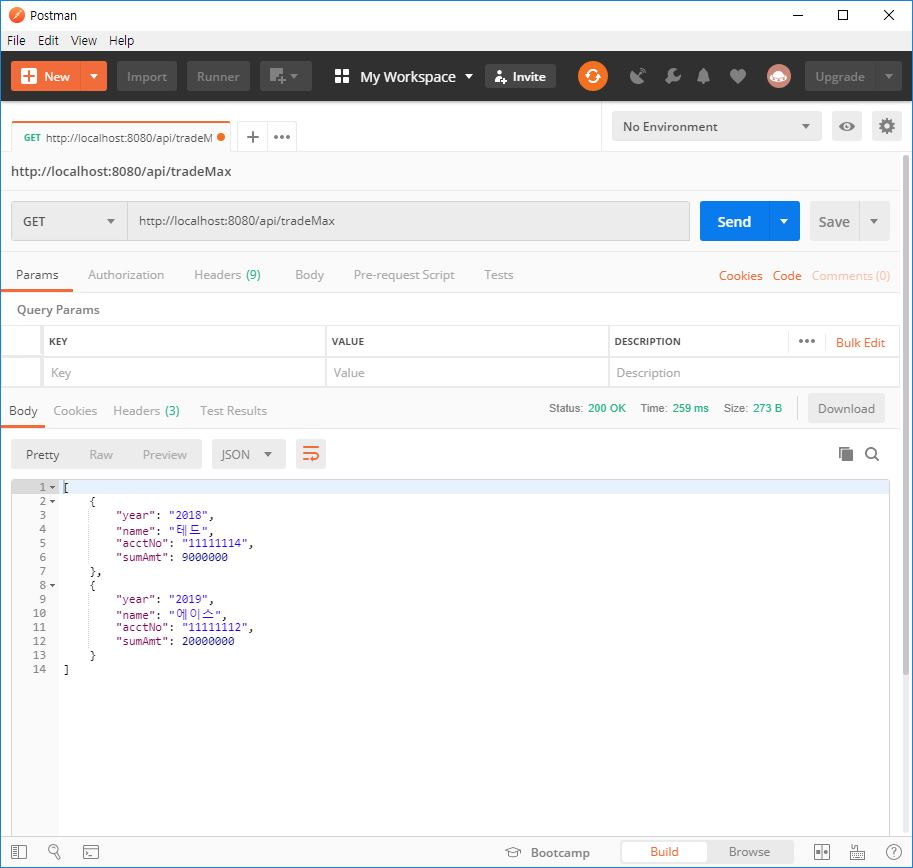
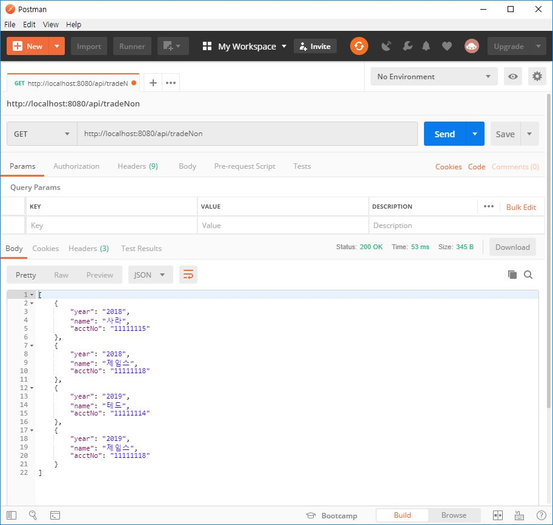
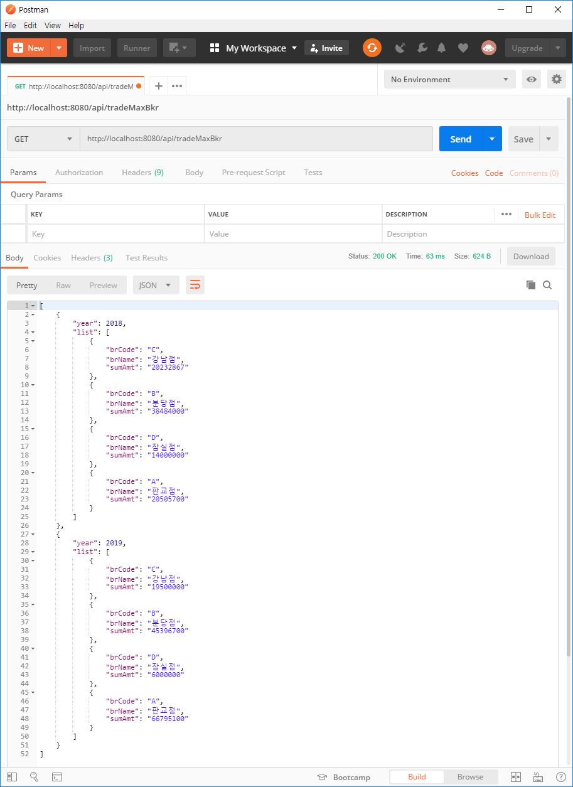
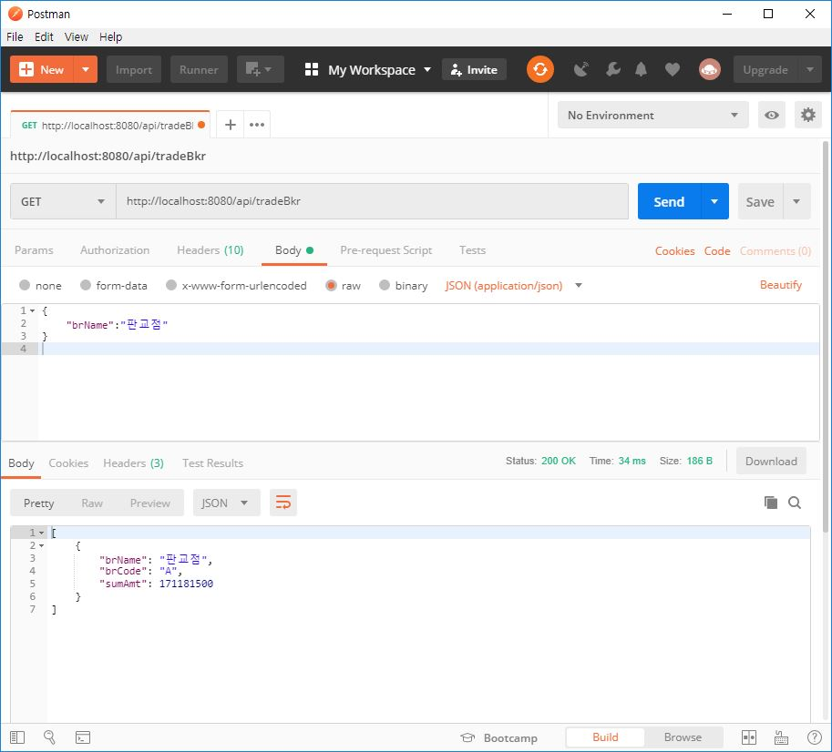
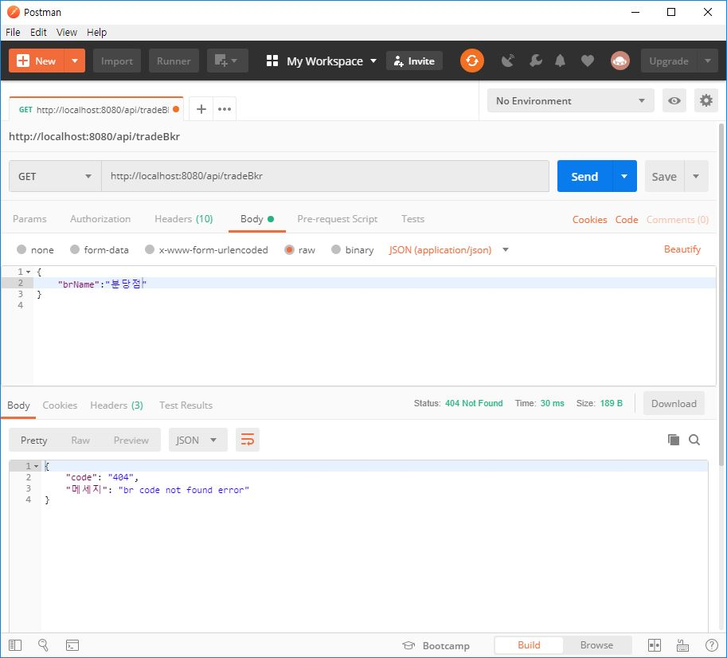
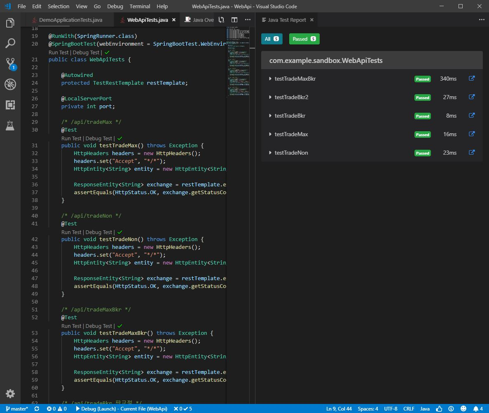

# 특정 고객 거래내역 조회 서비스 개발
---
### 개발환경
  - Spring Boot 2.1.5.RELEASE 
  - Java8+
  - JPA & H2 
  - Maven
  - IDE : VSCODE(Visual Studio Code)
  - OS : Windows 10

### 빌드 및 실행 방법
```
$ mvnw spring-boot:run
```

### API Swagger
http://localhost:8080/swagger-ui.html

### API 기능명세
**http://localhost:8080/**

| API | DESC |
| ------ | ------ |
| api/tradeMax | [1번문제] 2018년, 2019년 각 연도별 합계 금액이 가장 많은 고객을 추출하는 API 개발 |
| api/tradeNon | [2번문제] 2018년 또는 2019년에 거래가 없는 고객을 추출하는 API 개발 |
| api/tradeMaxBkr | [3번문제] 연도별 관리점 별 거래금액 합계를 구하고 합계금액이 큰 순서로 출력하는 API 개발 |
| api/tradeBkr | [4번문제] 분당점과 판교점을 통폐합하여 판교점으로 관리점 이관을 하였습니다. 지점명을 입력하면 해당지점의 거래금액 합계를 출력하는 API 개발 |

- [1번문제] api/tradeMax


- [2번문제] api/tradeNon


- [3번문제] api/tradeMaxBkr


- [4번문제] api/tradeBkr



### 단위 테스트
| UNIT TEST | API | DESC |
| ------ | ------ | ------ |
| testTradeMax | api/tradeMax |  |
| testTradeNon | api/tradeNon |  |
| testTradeMaxBkr | api/tradeMaxBkr |  |
| testTradeBkr | api/tradeBkr | 판교점 테스트 |
| testTradeBkr2 | api/tradeBkr | 분당점 테스트 |




